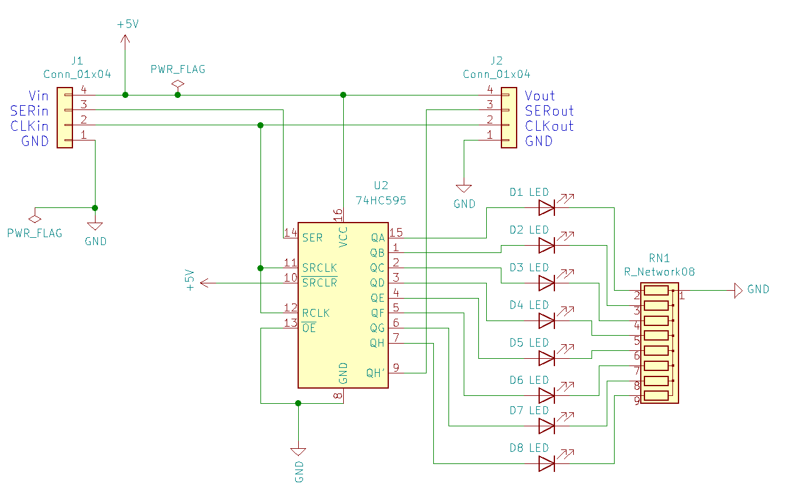
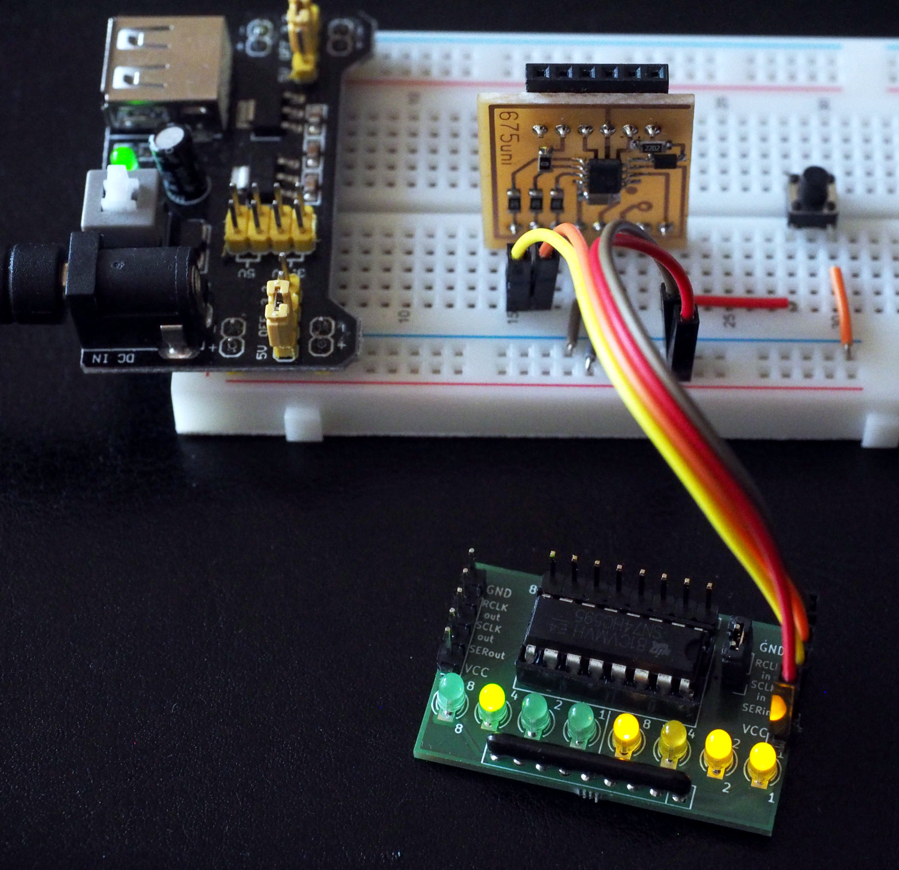

SN74HC595 based debugger for the PIC12F675
==========================================

This project provides a simple "debugger" based on the SN74HC595
shift-register. In this scenario the pic needs two GPs to clock out
data to the shift-register IC. Connecting eight leds to the IC you
can display whole bits. If you chain two 595 together, you can display
16 bit words.

To save a GP-line, we don't bother to clock out from serial-register
to parallel-register. Instead we connect SRCLK and RCLK. This needs an
additional clock-cycle for the last bit, i.e. the pic sends 9 bits
in total. With two connected 595-ICs, the pic sends 17 bits.

The example program waits for a button-press on GP5 and then displays
and increasing counter. It stops again once the counter wraps around to
zero or if the button is pressed again.

The KiCAD source of the pcb is in the directory `sn74hc595_dbg.kicad`. The
library and the example application is in the directory `src`. Note that
you need sdcc and gputils to compile and link the files, but porting
to a different toolchain should be simple.

You also need the header-files and makefile rules of my
[pic-toolchain](https://github.com/bablokb/pic-toolchain)-project.